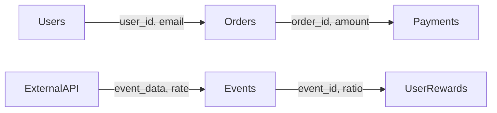
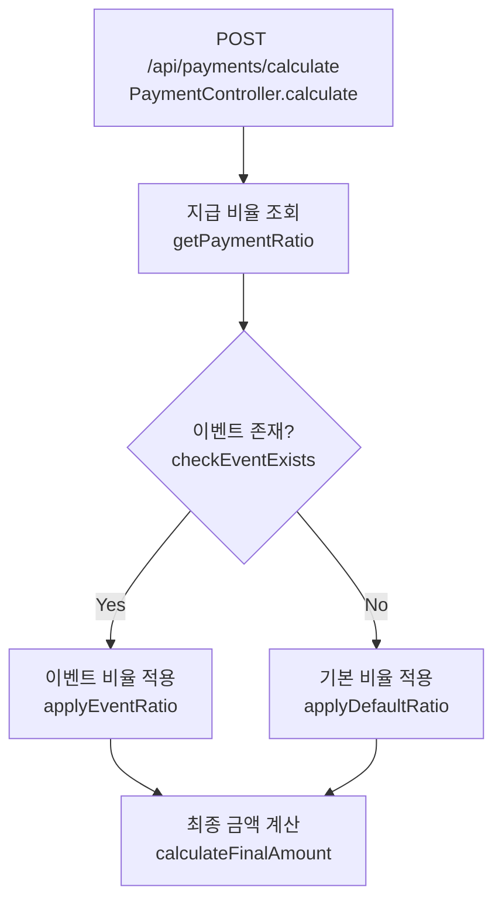
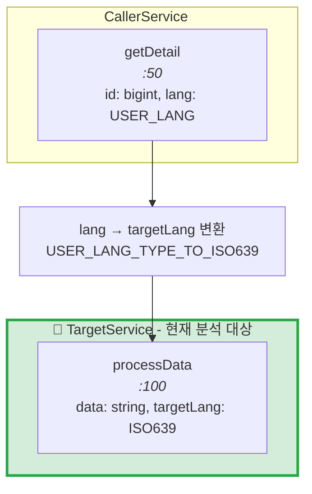

**코드 종합 분석 및 UML 생성**

분석 대상: $ARGUMENTS

**목표**

`$ARGUMENTS`에 지정된 코드를 종합적으로 분석하여 구조, 흐름, 관계를 Mermaid UML로 시각화합니다.

---

## 참조 

@.claude/core/MDX.md (MDX 문법 가이드)

## 0단계: 분석 단위 분리 (필수)

코드 분석 전 **반드시** 다음을 수행하세요:

1. **전체 코드 스캔**: 모든 함수, 클래스, 모듈 목록 작성
2. **논리적 단위 그룹핑**: 기능/도메인별로 분류
   - 예: 인증 모듈, 데이터 처리, API 핸들러, 유틸리티 등
3. **분석 단위 정의**: 각 그룹을 독립적인 분석 단위로 명명
4. **단위 간 의존성 파악**: 그룹 간 호출/참조 관계 정리

**출력 형식**:
```
## 분석 단위 목록
1. [단위명] - 포함 함수/클래스 목록, 역할 설명
2. [단위명] - ...
```

---

## 생성할 다이어그램

### 1. 데이터 흐름 다이어그램 (Data Flow)

- **형식**: `flowchart LR` 또는 `sequenceDiagram`
- **목적**: 테이블/저장소 간 데이터 이동을 구체적으로 시각화
- **포함 내용**:
  - **테이블 간 데이터 흐름**: 어떤 테이블에서 어떤 테이블로 이동하는지
  - **전달되는 필드 명시**: 화살표에 실제 필드명 표기
  - **외부 API 데이터**: 외부에서 들어오거나 나가는 데이터
  - **변환 로직**: 데이터가 변환되는 경우 변환 내용 명시

**표기 예시**:


### 2. 데이터베이스 스키마 다이어그램 (DB Schema)

- **형식**: `erDiagram`
- **목적**: 데이터 구조와 엔티티 관계 시각화
- **포함 내용**:
  - 엔티티/테이블/모델 구조
  - 필드명과 타입
  - PK, FK 관계
  - 카디널리티 (1:1, 1:N, N:M)
  - 컬럼별 비즈니스 역할 (id - 고유식별자, created_at - 생성일 등)
- **참고**: DB가 없으면 DTO/인터페이스 구조로 대체

### 3. 비즈니스 로직 함수 분석 (Function Analysis)

- **형식**: 마크다운 테이블 + 상세 설명
- **목적**: 각 비즈니스 로직 함수가 무엇을 하는지 사람이 이해하기 쉽게 분석
- **대상**: Service, UseCase, Domain 레이어의 핵심 함수 (Controller 제외)
- **포함 내용**:
  - 함수명과 파일 위치
  - 입력 파라미터와 출력 타입
  - **핵심 동작을 자연어로 설명**
  - **호출 체인 (Call Chain)**: 최상단 EndPoint(Controller/Handler)부터 해당 함수까지의 호출 경로 및 파라미터 전달 과정
  - **하위 호출 함수**: 해당 함수가 내부에서 호출하는 주요 함수/메서드
  - 예외 처리 및 엣지 케이스

**테이블 형식**:
| 함수명 | 위치 | 입력 | 출력 | 핵심 동작 |
|--------|------|------|------|-----------|
| `함수명` | `파일:라인` | 파라미터 설명 | 반환값 설명 | 자연어로 동작 설명 |

**상세 분석 예시**:
```markdown
#### `calculatePaymentRatio`
- **위치**: `src/services/payment.ts:45`
- **입력**: `userId: string`, `eventId?: string`
- **출력**: `PaymentRatio`
- **호출 체인** (EndPoint → 현재 함수):
  ```
  POST /api/payments/calculate (PaymentController:78)
    body: { userId, eventId? }
    → PaymentService.processPayment(userId, eventId):32
      → calculatePaymentRatio(userId, eventId):45 ← 현재 함수
  ```
- **핵심 동작**:
  1. 사용자 ID로 기본 지급 비율을 조회한다
  2. 이벤트 ID가 있으면 이벤트 테이블에서 추가 비율을 가져온다
  3. 두 비율을 합산하여 최종 비율을 계산한다
  4. 최대 비율(100%)을 초과하면 100%로 제한한다
- **하위 호출 함수**:
  - `getUserBaseRatio(userId)` → 사용자 기본 비율 조회
  - `getEventRatio(eventId)` → 이벤트 추가 비율 조회
  - `clampRatio(ratio, max)` → 최대값 제한 적용
- **예외 처리**: 사용자가 없으면 `UserNotFoundError` 발생
```

### 4. 비즈니스 로직 다이어그램 (Business Logic + Call Flow)

- **형식**: `flowchart TD`
- **목적**: 비즈니스 로직을 자연어로 설명하며, 각 단계에 실제 함수/코드 명시
- **포함 내용**:
  - **진입점 (EntryPoint)**: 시작 노드에 엔드포인트/파일명 명시
  - 주요 기능 블록 (한글 설명)
  - **각 단계별 실제 함수/메서드명 병기**
  - 조건 분기와 의사결정
  - 예외/에러 처리 경로

**표기 예시**:


- **형식 규칙**:
  - 진입점: `[HTTP메서드 /경로<br/>Controller.메서드명]`
  - 기본: `[한글 설명<br/>실제_함수명]`
  - 계산/집계: `["변수명 = 계산식"]` (쌍따옴표 필수)
  - 데이터 저장: `["필드명 → 값"]`

**데이터 흐름 명시 가이드**:
- 계산 로직이 포함된 경우, 다이어그램 아래에 **계산 공식 요약** 표 추가
- 표 형식:
  ```markdown
  | 필드/변수 | 계산식 | 의미 |
  |-----------|--------|------|
  | NOW_CNT | usablePopcorns.USABLE_CNT 합계 | 현재 사용 가능량 |
  ```
- 중간 변수가 최종 결과에 어떻게 사용되는지 명확히 연결

**모듈 경계 및 호출 체인 명시 가이드**:

- **현재 분석 대상 모듈 하이라이트** (필수):
  - subgraph 제목에 `🎯 현재 분석 대상` 명시
  - style로 초록색 배경 적용: `style SubgraphName fill:#d4edda,stroke:#28a745,stroke-width:3px`

- **서비스별 subgraph 그룹화** (필수):
  - 각 서비스/모듈을 별도 subgraph로 분리
  - subgraph 제목에 파일 경로 명시: `["ServiceName<br/><i>file-name.service.ts</i>"]`
  - 각 함수에 라인 번호 표기: `[함수명<br/><i>:라인번호</i>]`

- **진입점 구체화 규칙** (필수):
  - ❌ 금지: "외부 서비스 호출", "외부 모듈" 등 모호한 표현
  - ✅ 필수: 구체적인 서비스명.함수명 명시
  - 예시: `FanficEpisodesService.getEpisodeDetail` → `TranslationsService.getTranslatedLongText`

- **호출 체인 파라미터 변환 명시**:
  - 상위 → 하위 호출 시 파라미터 타입 변환 명시
  - 노드에 파라미터 정보 포함: `[함수명<br/><i>param1: Type, param2: Type</i>]`
  - 변환 과정 별도 노드로 표시: `[targetLanguage = USER_LANG_TYPE_TO_ISO639 변환]`

**예시**:


---

## 작업 순서

1. **0단계 완료** 후 분석 단위 목록 먼저 출력
2. 각 분석 단위별로 3가지 다이어그램 작성
3. 단위 간 통합 관계도 추가 (전체 아키텍처)

---

## 출력

- **파일명**: `{$ARGUMENTS에 들어간 원본 파일/모듈명}-code-analysis.mdx`
- **위치**: `prd` 폴더 (없으면 생성)
- **구조**:
  ```
  # 코드 종합 분석: [대상명]

  ## 분석 단위 목록
  ...

  ## [단위명]
  ### 데이터 흐름
  ### DB 스키마
  ### 비즈니스 로직 함수 분석
  ### 비즈니스 로직 다이어그램

  ## [단위명]
  ...

  ## 전체 아키텍처
  ```

---

## 제약 사항

- 모든 설명과 레이블은 **한글**로 작성
- H 태그에 **숫자 표기 금지** (예: `## 1. ...`, `### 1.1` X → `## ...`, `### ...` O)
  - 단계도 표기 금지 (예: `## 단계 1`, `### Step 1`, `### Phase 2` X)
- 다이어그램당 노드 수 **20개 이내**로 간결하게
- 핵심 흐름에 집중, 사소한 유틸 함수는 생략 가능
- 각 다이어그램에 **간단한 설명 문단** 추가
- 데이터 흐름에서 **실제 테이블명과 필드명** 반드시 명시
- mdx 문법 준수해서 작성
