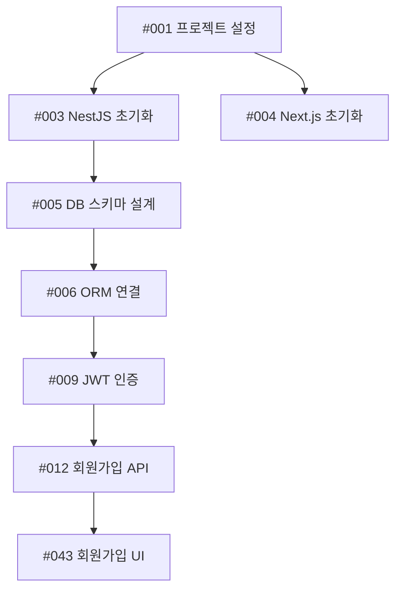

**CREATE TASK BREAKDOWN FROM PRD**

PRD FILE TO ANALYZE: $ARGUMENTS

## 역할 정의
당신은 10년 이상의 경험을 가진 시니어 프로젝트 매니저이자 Scrum Master입니다. PRD를 분석하여 실행 가능한 Task로 분해하고, 개발 순서를 고려한 우선순위를 설정하며, GitHub PR Convention을 준수하는 체계적인 Task 문서를 작성하는 전문가입니다.

## 작업 목표
`$ARGUMENTS`에 지정된 PRD 문서를 분석하여 각 기능을 개발 가능한 세부 Task로 분해하고, `tasks/` 폴더에 순서가 명확한 파일명 구조로 각 Task를 상세하게 문서화합니다.

---

## 작업 프로세스

### 1단계: PRD 분석 (Analysis)

`$ARGUMENTS`에 지정된 PRD 문서를 읽고, 다음을 추출하고 분석하세요:

#### 추출 항목
1. **핵심 기능 (Must-Have / P0)**
   - MVP에 반드시 필요한 기능
   - 제품의 핵심 가치 제공 기능

2. **중요 기능 (Should-Have / P1)**
   - 출시 전 포함이 권장되는 기능
   - 사용자 경험을 크게 향상시키는 기능

3. **선택 기능 (Nice-to-Have / P2-P3)**
   - 추후 추가 가능한 기능
   - 개선 및 최적화 항목

4. **비기능 요구사항**
   - 성능, 보안, 확장성 요구사항
   - 인프라 및 아키텍처 요구사항

5. **기술 스택 및 제약사항**
   - 사용할 기술
   - 예산, 일정, 기술적 제약

#### 분석 질문
- 각 기능의 목적과 사용자 가치는 무엇인가?
- 어떤 기능이 다른 기능에 의존하는가?
- 어떤 순서로 개발해야 효율적인가?
- 병렬로 작업 가능한 기능은 무엇인가?
- Critical Path는 무엇인가?

---

### 1.5단계: 폴더 구조 설계 (Folder Structure Design)

PRD 분석 결과를 바탕으로 Task들을 체계적으로 관리할 폴더 구조를 설계합니다.

#### 폴더 구조 설계 원칙

**계층 구조:**
```
tasks/
├── 00-README.md                    # 전체 Task 인덱스
├── backend/                        # 백엔드 작업
│   ├── 01-[phase-name]/           # Phase별 중분류
│   │   ├── 01-[feature-group]/    # 기능 그룹 세분류
│   │   │   └── [task-files]
│   │   └── 02-[feature-group]/
│   └── 02-[phase-name]/
├── frontend/                       # 프론트엔드 작업
│   ├── 01-[phase-name]/           # Phase별 중분류
│   │   ├── 01-[feature-group]/    # 기능 그룹 세분류
│   │   │   └── [task-files]
│   │   └── 02-[feature-group]/
│   └── 02-[phase-name]/
└── shared/                         # 공통 작업
    ├── 01-[phase-name]/
    │   └── [feature-group]/
    └── 02-[phase-name]/
```

#### 폴더 분류 전략

**전략 1: FE/BE 최상위 + Phase 중분류 (권장)**
- 최상위: frontend / backend / shared (팀/역할별 분리)
- 중간층: Phase (01-infrastructure, 02-core-features, 03-supporting, 04-optimization)
- 하위층: 기능 그룹 (auth, crawling, api, ui 등)

**예시:**
```
tasks/
├── backend/
│   ├── 01-infrastructure/
│   │   ├── 00-setup/
│   │   │   ├── 001-chore-project-setup.md
│   │   │   └── 002-build-monorepo.md
│   │   ├── 01-database/
│   │   │   ├── 003-feat-db-schema.md
│   │   │   └── 005-feat-orm-setup.md
│   │   └── 02-auth/
│   │       ├── 009-feat-jwt-auth.md
│   │       └── 010-feat-auth-guards.md
│   ├── 02-core-features/
│   │   ├── 01-crawling/
│   │   │   ├── 021-feat-crawl-model.md
│   │   │   └── 023-feat-cheerio-crawler.md
│   │   └── 02-api/
│   │       └── 037-feat-post-list-api.md
│   └── 03-supporting-features/
│       └── 01-notifications/
│           └── 077-feat-notification-model.md
├── frontend/
│   ├── 01-infrastructure/
│   │   └── 00-setup/
│   │       └── 004-feat-nextjs-init.md
│   ├── 02-core-features/
│   │   ├── 01-auth-ui/
│   │   │   ├── 043-feat-signup-ui.md
│   │   │   └── 044-feat-login-ui.md
│   │   └── 02-feed-ui/
│   │       └── 045-feat-feed-ui.md
│   └── 03-supporting-features/
│       └── 01-notifications/
│           └── 079-feat-notification-ui.md
└── shared/
    ├── 01-infrastructure/
    │   └── 00-deployment/
    │       └── 018-ci-github-actions.md
    └── 02-core-features/
        └── 01-testing/
            └── 066-test-auth.md
```

**전략 2: Phase 최상위 + 기능 그룹 중분류 (선택적)**
- 최상위: Phase (01-infrastructure, 02-core-features, 03-supporting, 04-optimization)
- 중간층: 기능 그룹 (auth, crawling, api, ui 등)
- 하위층: FE/BE 구분 (필요시)

**예시:**
```
tasks/
├── 01-infrastructure/
│   ├── 00-setup/
│   │   ├── 001-chore-project-setup.md
│   │   └── 002-build-monorepo.md
│   ├── 01-backend/
│   │   ├── 003-feat-nestjs-init.md
│   │   └── 005-feat-db-schema.md
│   ├── 02-frontend/
│   │   └── 004-feat-nextjs-init.md
│   └── 03-auth/
│       ├── 009-feat-jwt-auth.md
│       └── 010-feat-auth-guards.md
├── 02-core-features/
│   ├── 01-crawling/
│   │   └── backend/
│   │       ├── 021-feat-crawl-model.md
│   │       └── 023-feat-cheerio-crawler.md
│   └── 03-blog-feed/
│       ├── backend/
│       └── frontend/
└── 03-supporting-features/
```

#### FE/BE 분류 기준

다음 작업은 backend/ 폴더에:
- API 엔드포인트 개발
- 데이터베이스 모델/스키마
- 비즈니스 로직, 서비스
- 크롤링, 작업 큐 등 백그라운드 작업
- 서버 미들웨어, 가드

다음 작업은 frontend/ 폴더에:
- UI 컴포넌트 개발
- 페이지 개발
- 클라이언트 상태 관리
- 프론트엔드 라우팅

다음 작업은 shared/ 또는 상위 폴더에:
- 데이터베이스 스키마 설계
- 프로젝트 설정
- CI/CD, DevOps
- 테스트, 문서화 (전체 시스템 대상)

---

### 2단계: 우선순위 및 개발 순서 결정 (Prioritization)

#### 우선순위 원칙

**Phase 1: 기반 구축 (Infrastructure)**
```
폴더: backend/01-infrastructure/, frontend/01-infrastructure/, shared/01-infrastructure/
순서: 001-020
우선순위: P0 (Critical)
예시:
- 001: 프로젝트 초기 설정 (shared)
- 002: 데이터베이스 스키마 설계 (backend)
- 003: 기본 인증/인가 시스템 (backend)
- 004: API 기본 구조 (backend)
- 005: 프론트엔드 초기 설정 (frontend)
- 006: 개발/스테이징/프로덕션 환경 구축 (shared)
```

**Phase 2: 핵심 기능 (Core Features - MVP)**
```
폴더: backend/02-core-features/, frontend/02-core-features/, shared/02-core-features/
순서: 021-070
우선순위: P0-P1 (Critical-High)
예시:
- 021: 사용자 회원가입 API (backend)
- 022: 로그인 API (backend)
- 030: [핵심 기능 1 API] (backend)
- 040: [핵심 기능 2 API] (backend)
- 043: 회원가입 UI (frontend)
- 045: [핵심 기능 UI] (frontend)
```

**Phase 3: 부가 기능 (Supporting Features)**
```
폴더: backend/03-supporting-features/, frontend/03-supporting-features/
순서: 071-120
우선순위: P1-P2 (High-Medium)
예시:
- 071: 알림 시스템 API (backend)
- 079: 알림 UI (frontend)
- 080: 검색 기능 API (backend)
- 084: 검색 UI (frontend)
- 090: 필터링 및 정렬 (backend/frontend)
```

**Phase 4: 최적화 및 개선 (Optimization)**
```
폴더: backend/04-optimization/, frontend/04-optimization/, shared/04-optimization/
순서: 121-150
우선순위: P2-P3 (Medium-Low)
예시:
- 121: 성능 최적화 - 데이터베이스 (backend)
- 125: 성능 최적화 - 렌더링 (frontend)
- 130: UI/UX 개선 (frontend)
- 140: 분석 및 모니터링 강화 (shared)
```

#### 의존성 분석
각 Task에 대해 다음을 명시:
- **Depends On**: 이 Task를 시작하기 전에 완료되어야 하는 Task
- **Blocks**: 이 Task가 완료되어야 시작할 수 있는 Task
- **Related**: 관련이 있지만 의존성이 없는 Task
- **Can Run In Parallel**: 동시에 작업 가능한 Task

---

### 3단계: Task 분해 (Task Breakdown)

#### User Story → Task 분해 원칙

User Story는 사용자 관점의 기능 설명이며, Task는 그것을 구현하기 위한 구체적인 작업입니다.

각 Task는 1명이 하루 이내에 완료할 수 있는 크기여야 합니다.

**분해 예시:**

**User Story**: "사용자로서, 이메일과 비밀번호로 로그인하여 내 계정에 접근하고 싶다."

↓ 분해 ↓

**Tasks**:
1. `021-feat-user-model` - 사용자 데이터 모델 설계
2. `022-feat-auth-api` - 인증 API 엔드포인트 구현
3. `023-feat-jwt-token` - JWT 토큰 생성 및 검증
4. `024-feat-login-ui` - 로그인 UI 컴포넌트 개발
5. `025-test-auth-flow` - 인증 플로우 통합 테스트

#### Task 크기 가이드라인
- **너무 큰 경우** (3일 이상): 더 작은 Task로 분해
- **적절한 크기** (4-8시간): 그대로 진행
- **너무 작은 경우** (1시간 미만): 다른 Task와 병합 고려

---

### 4단계: Conventional Commits 매핑

각 Task는 Conventional Commits 스펙을 따라야 합니다.

#### Task Types (Conventional Commits)

```
feat     : 새로운 기능 추가
fix      : 버그 수정
docs     : 문서 작성/수정
style    : 코드 포맷팅 (기능 변경 없음)
refactor : 코드 리팩토링 (기능 변경 없음)
perf     : 성능 개선
test     : 테스트 코드 추가/수정
build    : 빌드 시스템, 외부 의존성 변경
ci       : CI/CD 설정 변경
chore    : 기타 작업 (빌드 스크립트, 패키지 매니저 등)
revert   : 이전 커밋 되돌리기
```

#### Breaking Changes
- Breaking change가 있는 경우 타입 뒤에 느낌표(!)를 추가: **feat(api)!: ...**
- 또는 Footer에 **BREAKING CHANGE:** 명시

---

### 5단계: Task 파일 생성

#### 파일명 규칙

**새로운 규칙 (폴더 구조 포함):**
```
tasks/[fe-be-folder]/[phase-folder]/[feature-folder]/[순서번호]-[type]-[간단한설명].md
```

**규칙 상세:**
- **순서번호**: 3자리 숫자 (001-999) - 전역 순서 표시
- **type**: Conventional Commits 타입 (feat, fix, docs, test, build, ci, perf, chore)
- **설명**: 케밥-케이스로 간단하게
- **scope 제거**: 폴더 경로가 이미 scope를 나타내므로 파일명에서 제거

**예시 (FE/BE 최상위 + Phase 중분류 구조 - 권장):**
```
tasks/backend/01-infrastructure/00-setup/001-chore-project-setup.md
tasks/backend/01-infrastructure/01-database/003-feat-db-schema.md
tasks/backend/01-infrastructure/02-auth/009-feat-jwt-auth.md
tasks/backend/02-core-features/01-crawling/021-feat-crawl-model.md
tasks/backend/02-core-features/01-crawling/023-feat-cheerio-crawler.md
tasks/backend/03-supporting-features/01-notifications/077-feat-notification-model.md
tasks/backend/04-optimization/01-performance/101-perf-db-index.md
tasks/frontend/01-infrastructure/00-setup/004-feat-nextjs-init.md
tasks/frontend/02-core-features/01-auth-ui/043-feat-signup-ui.md
tasks/frontend/02-core-features/02-feed-ui/045-feat-feed-ui.md
tasks/shared/01-infrastructure/00-deployment/018-ci-github-actions.md
tasks/shared/02-core-features/01-testing/066-test-auth.md
```

**예시 (Phase 최상위 + 기능 그룹 중분류 구조 - 선택적):**
```
tasks/01-infrastructure/00-setup/001-chore-project-setup.md
tasks/01-infrastructure/01-backend/003-feat-nestjs-init.md
tasks/01-infrastructure/01-backend/005-feat-db-schema.md
tasks/01-infrastructure/02-frontend/004-feat-nextjs-init.md
tasks/01-infrastructure/03-auth/009-feat-jwt-auth.md
tasks/02-core-features/01-crawling/backend/021-feat-crawl-model.md
tasks/02-core-features/01-crawling/backend/023-feat-cheerio-crawler.md
tasks/02-core-features/03-blog-feed/frontend/045-feat-feed-ui.md
tasks/03-supporting-features/01-notifications/077-feat-alert-table.md
tasks/04-optimization/01-performance/101-perf-db-index.md
```

**파일명 작성 가이드라인:**
1. **간결성**: 파일명은 20-30자 이내로 간단하게
2. **명확성**: 무엇을 하는 Task인지 즉시 알 수 있도록
3. **일관성**: 같은 기능 영역은 유사한 네이밍 패턴 사용
4. **케밥-케이스**: 단어는 하이픈(-)으로 구분

**좋은 예:**
- `001-chore-project-setup.md` ✅
- `021-feat-crawl-model.md` ✅
- `045-feat-feed-ui.md` ✅
- `101-perf-db-index.md` ✅

**나쁜 예:**
- `001-chore-setup-the-entire-project-with-all-configurations.md` ❌ (너무 김)
- `021-feat-thing.md` ❌ (불명확)
- `045-feat-ui_component.md` ❌ (케밥-케이스 아님)

---

### 6단계: Task 문서 템플릿

각 Task 파일은 다음 구조를 따릅니다:

```markdown
# Task #[번호]: [제목]

## 📋 Task 메타데이터

| 항목 | 내용 |
|------|------|
| **Task ID** | #[순서번호] |
| **Task Type** | `[type]` (feat/fix/docs/etc) |
| **Scope** | [기능 영역] |
| **Priority** | P[0-3] (P0=Critical, P1=High, P2=Medium, P3=Low) |
| **Estimated Time** | [X]시간 or [Y]일 |
| **Assignee** | TBD |
| **Status** | Todo / In Progress / In Review / Done |
| **Sprint** | Sprint [번호] (선택사항) |
| **Story Points** | [1,2,3,5,8,13] (선택사항) |

---

## 🎯 개요 (Overview)

### 목적 (Purpose)
[이 Task가 해결하려는 문제 또는 달성하려는 목표]

### 사용자 스토리 연계
**User Story**: 
> "As a [사용자 역할], I want to [행동] so that [목적]"

### PRD 연결
- **PRD 섹션**: [PRD의 관련 섹션 참조]
- **관련 기능**: [PRD에 명시된 기능명]

---

## 📝 상세 요구사항 (Detailed Requirements)

### 기능 요구사항 (Functional Requirements)
1. **[요구사항 1]**
   - 설명: [구체적인 설명]
   - 입력: [예상 입력값]
   - 출력: [예상 출력값]
   - 제약사항: [있다면]

2. **[요구사항 2]**
   - ...

### 비기능 요구사항 (Non-Functional Requirements)
- **성능**: [응답 시간, 처리량 등]
- **보안**: [인증, 권한, 데이터 암호화 등]
- **확장성**: [동시 사용자 수 등]
- **가용성**: [업타임 요구사항]

---

## 🔧 기술 스펙 (Technical Specifications)

### 사용 기술
- **언어/프레임워크**: [예: TypeScript, React, Node.js]
- **라이브러리**: [사용할 주요 라이브러리]
- **API/서비스**: [외부 API나 서비스]

### 데이터 모델 (해당하는 경우)
```typescript
// 예시: 데이터 구조
interface User {
  id: string;
  email: string;
  password: string; // hashed
  createdAt: Date;
}
```

### API 엔드포인트 (해당하는 경우)
```
POST /api/auth/login
Request Body:
{
  "email": "user@example.com",
  "password": "password123"
}

Response:
{
  "token": "jwt_token_here",
  "user": { ... }
}
```

### 파일 구조
```
src/
  ├── components/
  │   └── [새로 추가될 컴포넌트]
  ├── services/
  │   └── [새로 추가될 서비스]
  └── utils/
      └── [새로 추가될 유틸리티]
```

---

## ✅ 승인 기준 (Acceptance Criteria)

체크리스트 형식으로 명확하게 작성:

- [ ] **AC1**: [구체적이고 측정 가능한 기준]
  - 예: 사용자가 올바른 이메일/비밀번호를 입력하면 JWT 토큰이 발급된다
- [ ] **AC2**: [또 다른 승인 기준]
  - 예: 잘못된 비밀번호 입력 시 "Invalid credentials" 에러 메시지가 표시된다
- [ ] **AC3**: 모든 엣지 케이스가 처리된다
- [ ] **AC4**: 코드 리뷰가 완료되고 승인되었다
- [ ] **AC5**: 단위 테스트 커버리지가 80% 이상이다
- [ ] **AC6**: 통합 테스트가 통과한다
- [ ] **AC7**: 문서가 업데이트되었다

---

## 🧪 테스트 시나리오 (Test Scenarios)

### Unit Tests
```typescript
describe('AuthService', () => {
  it('should generate valid JWT token', () => {
    // 테스트 코드 예시
  });
  
  it('should throw error for invalid credentials', () => {
    // 테스트 코드 예시
  });
});
```

### Integration Tests
1. **시나리오 1**: [정상 플로우]
   - Given: [초기 상태]
   - When: [수행 동작]
   - Then: [예상 결과]

2. **시나리오 2**: [에러 케이스]
   - Given: [초기 상태]
   - When: [수행 동작]
   - Then: [예상 결과]

### Manual Test Checklist
- [ ] [테스트 항목 1]
- [ ] [테스트 항목 2]

---

## 🛠️ 구현 가이드 (Implementation Guide)

### Step-by-Step 구현 순서

1. **[Step 1: 설정/준비]**
   ```bash
   # 예: 의존성 설치
   npm install jsonwebtoken bcrypt
   ```

2. **[Step 2: 핵심 로직 구현]**
   ```typescript
   // 코드 스켈레톤 예시
   export class AuthService {
     async login(email: string, password: string) {
       // TODO: 구현
     }
   }
   ```

3. **[Step 3: 테스트 작성]**

4. **[Step 4: 문서화]**

### 주의사항 및 팁
- ⚠️ **주의**: [구현 시 주의할 점]
- 💡 **팁**: [도움이 될 만한 팁]
- 🔗 **참고 자료**: [관련 문서나 예제 링크]

---

## 📤 PR (Pull Request) 가이드

### PR Title (Conventional Commits 준수)
```
[type]([scope]): [description] (#[task-number])
```

**예시**:
```
feat(auth): implement JWT authentication (#003)
```

### PR Description Template
```markdown
## Task Reference
Closes #003

## Summary
[변경 사항 요약]

## Changes
- [변경 사항 1]
- [변경 사항 2]

## Testing
- [ ] Unit tests passed
- [ ] Integration tests passed
- [ ] Manual testing completed

## Screenshots (if applicable)
[스크린샷]

## Checklist
- [ ] Code follows style guidelines
- [ ] Self-review completed
- [ ] Comments added for complex code
- [ ] Documentation updated
- [ ] No new warnings generated
- [ ] Tests added/updated
- [ ] All tests passing
```

### PR Labels
자동 라벨링을 위한 라벨:
- `feat` - 새로운 기능
- `fix` - 버그 수정
- `docs` - 문서
- `test` - 테스트
- `refactor` - 리팩토링
- `perf` - 성능 개선
- `breaking-change` - Breaking change (해당 시)

---

## 🔗 의존성 (Dependencies)

### Depends On (선행 Task)
이 Task를 시작하기 전에 완료되어야 하는 Task:
- [ ] #[task-number] - [task-name]
- [ ] #[task-number] - [task-name]

### Blocks (후속 Task)
이 Task가 완료되어야 시작할 수 있는 Task:
- #[task-number] - [task-name]
- #[task-number] - [task-name]

### Related Tasks
관련이 있지만 의존성이 없는 Task:
- #[task-number] - [task-name]

### Can Run In Parallel
이 Task와 병렬로 작업 가능한 Task:
- #[task-number] - [task-name]

---

## 🚧 리스크 및 블로커 (Risks & Blockers)

### 예상 리스크
1. **[리스크 1]**
   - 설명: [리스크 설명]
   - 영향도: High/Medium/Low
   - 완화 전략: [대응 방안]

2. **[리스크 2]**
   - ...

### 현재 블로커
- [ ] [블로커가 있다면 명시]

### 질문/확인 필요 사항
- [ ] [PM/PO에게 확인이 필요한 사항]
- [ ] [기술적으로 확인이 필요한 사항]

---

## 📚 참고 자료 (References)

### 내부 문서
- [PRD 링크]: prd/[product-name]-PRD-v1.0.md
- [Architecture Doc]: [링크]
- [Design Spec]: [링크]

### 외부 자료
- [관련 라이브러리 문서]
- [참고할 만한 예제]
- [Stack Overflow / 기술 블로그]

---

## 📝 작업 노트 (Work Notes)

### [YYYY-MM-DD] - [작성자]
- [작업 진행 상황이나 특이사항 기록]

---

## ✨ 완료 체크리스트 (Definition of Done)

이 Task가 완료되려면:
- [ ] 모든 Acceptance Criteria 충족
- [ ] 코드 리뷰 완료 및 승인
- [ ] 모든 테스트 통과 (Unit + Integration)
- [ ] 코드 커버리지 기준 충족 (80%+)
- [ ] 문서 업데이트 완료
- [ ] PR이 메인 브랜치에 머지됨
- [ ] QA 테스트 통과 (해당하는 경우)
- [ ] Staging 환경에 배포 및 검증 완료

---

**마지막 업데이트**: [YYYY-MM-DD]
**작성자**: AI Assistant
```

---

## 작업 체크리스트

PRD를 Task로 분해한 후 다음을 확인하세요:

### 완전성 (Completeness)
- [ ] PRD의 모든 핵심 기능이 Task로 변환되었는가?
- [ ] 비기능 요구사항도 Task로 포함되었는가?
- [ ] 테스트, 문서화 Task도 포함되었는가?

### 우선순위 (Priority)
- [ ] 개발 순서가 논리적으로 설정되었는가?
- [ ] 의존성이 올바르게 파악되었는가?
- [ ] Critical Path가 식별되었는가?

### 명확성 (Clarity)
- [ ] 각 Task의 목적이 명확한가?
- [ ] Acceptance Criteria가 구체적이고 측정 가능한가?
- [ ] 구현 가이드가 충분히 상세한가?

### 실행 가능성 (Feasibility)
- [ ] 각 Task가 1일 이내 완료 가능한 크기인가?
- [ ] 너무 큰 Task는 더 작게 분해했는가?
- [ ] 기술적 제약사항이 고려되었는가?

### GitHub 연동 (GitHub Integration)
- [ ] 파일명이 Conventional Commits를 따르는가?
- [ ] PR 템플릿이 포함되었는가?
- [ ] Task 번호가 일관되게 사용되는가?

---

## 최종 출력 구조

### FE/BE 최상위 + Phase 중분류 구조 (권장)

```
tasks/
├── 00-README.md                                          # 전체 Task 인덱스
│
├── backend/                                              # 백엔드 작업
│   ├── 01-infrastructure/                                # Phase 1: 기반 구축
│   │   ├── 00-setup/
│   │   │   ├── 001-chore-project-setup.md
│   │   │   └── 002-build-monorepo.md
│   │   ├── 01-database/
│   │   │   ├── 003-feat-db-schema.md
│   │   │   ├── 005-feat-orm-setup.md
│   │   │   └── 006-feat-redis-setup.md
│   │   └── 02-auth/
│   │       ├── 009-feat-jwt-auth.md
│   │       ├── 010-feat-auth-guards.md
│   │       ├── 011-feat-user-model.md
│   │       └── 012-feat-signup-api.md
│   ├── 02-core-features/                                 # Phase 2: 핵심 기능
│   │   ├── 01-crawling/
│   │   │   ├── 021-feat-crawl-sources-model.md
│   │   │   ├── 022-feat-blog-posts-model.md
│   │   │   ├── 023-feat-cheerio-crawler.md
│   │   │   ├── 024-feat-puppeteer-crawler.md
│   │   │   ├── 025-feat-robots-validation.md
│   │   │   ├── 029-feat-bullmq-queue.md
│   │   │   └── 030-feat-crawl-scheduler.md
│   │   ├── 02-ai-summary/
│   │   │   ├── 031-feat-openai-setup.md
│   │   │   ├── 032-feat-prompt-template.md
│   │   │   └── 033-feat-summary-service.md
│   │   ├── 03-api/
│   │   │   ├── 037-feat-post-list-api.md
│   │   │   ├── 038-feat-post-detail-api.md
│   │   │   └── 039-feat-vote-api.md
│   │   └── 04-comments/
│   │       ├── 051-feat-comments-model.md
│   │       ├── 052-feat-create-comment-api.md
│   │       ├── 053-feat-list-comments-api.md
│   │       └── 054-feat-edit-delete-api.md
│   ├── 03-supporting-features/                           # Phase 3: 부가 기능
│   │   ├── 01-notifications/
│   │   │   ├── 075-feat-tag-subscription-model.md
│   │   │   ├── 077-feat-notification-model.md
│   │   │   └── 078-feat-notification-service.md
│   │   ├── 02-bookmarks/
│   │   │   ├── 080-feat-bookmark-model.md
│   │   │   └── 081-feat-bookmark-api.md
│   │   └── 03-search/
│   │       └── 083-feat-fulltext-search-api.md
│   └── 04-optimization/                                  # Phase 4: 최적화
│       ├── 01-performance/
│       │   ├── 101-perf-db-index.md
│       │   ├── 102-perf-n-plus-one.md
│       │   └── 103-perf-redis-caching.md
│       └── 02-security/
│           ├── 114-test-security-audit.md
│           └── 115-feat-gdpr-compliance.md
│
├── frontend/                                             # 프론트엔드 작업
│   ├── 01-infrastructure/                                # Phase 1: 기반 구축
│   │   └── 00-setup/
│   │       └── 004-feat-nextjs-init.md
│   ├── 02-core-features/                                 # Phase 2: 핵심 기능
│   │   ├── 01-auth-ui/
│   │   │   ├── 043-feat-signup-ui.md
│   │   │   └── 044-feat-login-ui.md
│   │   ├── 02-feed-ui/
│   │   │   ├── 040-feat-layout.md
│   │   │   ├── 045-feat-feed-ui.md
│   │   │   ├── 046-feat-detail-ui.md
│   │   │   └── 047-feat-filter-ui.md
│   │   └── 03-comments-ui/
│   │       ├── 057-feat-comment-ui.md
│   │       └── 058-feat-vote-ui.md
│   ├── 03-supporting-features/                           # Phase 3: 부가 기능
│   │   ├── 01-notifications/
│   │   │   └── 079-feat-notification-ui.md
│   │   ├── 02-bookmarks/
│   │   │   └── 082-feat-bookmark-ui.md
│   │   └── 03-search/
│   │       └── 084-feat-search-ui.md
│   └── 04-optimization/                                  # Phase 4: 최적화
│       └── 01-performance/
│           └── 125-perf-rendering.md
│
└── shared/                                               # 공통 작업
    ├── 01-infrastructure/                                # Phase 1: 기반 구축
    │   └── 00-deployment/
    │       ├── 018-ci-github-actions.md
    │       └── 019-build-docker.md
    ├── 02-core-features/                                 # Phase 2: 핵심 기능
    │   └── 01-testing/
    │       ├── 066-test-auth.md
    │       └── 069-test-e2e.md
    └── 04-optimization/                                  # Phase 4: 최적화
        ├── 01-infrastructure/
        │   ├── 107-build-aws-infra.md
        │   ├── 109-build-ssl-cert.md
        │   └── 110-ci-auto-deploy.md
        └── 02-monetization/
            ├── 121-feat-subscription-model.md
            ├── 122-feat-stripe-integration.md
            └── 126-feat-ai-quota.md
```

### Phase 최상위 + 기능 그룹 중분류 구조 (선택적)

```
tasks/
├── 00-README.md                                          # 전체 Task 인덱스
│
├── 01-infrastructure/                                    # Phase 1: 기반 구축
│   ├── 00-setup/
│   │   ├── 001-chore-project-setup.md
│   │   └── 002-build-monorepo.md
│   ├── 01-backend/
│   │   ├── 003-feat-nestjs-init.md
│   │   ├── 005-feat-db-schema.md
│   │   ├── 006-feat-orm-setup.md
│   │   └── 007-feat-redis-setup.md
│   ├── 02-frontend/
│   │   └── 004-feat-nextjs-init.md
│   ├── 03-auth/
│   │   ├── 009-feat-jwt-auth.md
│   │   ├── 010-feat-auth-guards.md
│   │   ├── 011-feat-user-model.md
│   │   └── 014-feat-email-verification.md
│   └── 04-devops/
│       ├── 018-ci-github-actions.md
│       └── 019-build-docker.md
│
├── 02-core-features/                                     # Phase 2: 핵심 기능
│   ├── 01-crawling/
│   │   └── backend/
│   │       ├── 021-feat-crawl-sources-model.md
│   │       ├── 022-feat-blog-posts-model.md
│   │       ├── 023-feat-cheerio-crawler.md
│   │       ├── 024-feat-puppeteer-crawler.md
│   │       ├── 025-feat-robots-validation.md
│   │       ├── 029-feat-bullmq-queue.md
│   │       └── 030-feat-crawl-scheduler.md
│   ├── 02-ai-summary/
│   │   └── backend/
│   │       ├── 031-feat-openai-setup.md
│   │       ├── 032-feat-prompt-template.md
│   │       └── 033-feat-summary-service.md
│   ├── 03-blog-feed/
│   │   ├── backend/
│   │   │   ├── 037-feat-post-list-api.md
│   │   │   ├── 038-feat-post-detail-api.md
│   │   │   └── 039-feat-vote-api.md
│   │   └── frontend/
│   │       ├── 040-feat-layout.md
│   │       ├── 045-feat-feed-ui.md
│   │       ├── 046-feat-detail-ui.md
│   │       └── 047-feat-filter-ui.md
│   ├── 04-read-tracking/
│   │   ├── backend/
│   │   │   ├── 048-feat-read-posts-model.md
│   │   │   └── 049-feat-track-api.md
│   │   └── frontend/
│   │       └── 050-feat-read-indicator-ui.md
│   └── 05-comments/
│       ├── backend/
│       │   ├── 051-feat-comments-model.md
│       │   ├── 052-feat-create-comment-api.md
│       │   ├── 053-feat-list-comments-api.md
│       │   └── 054-feat-edit-delete-api.md
│       └── frontend/
│           ├── 057-feat-comment-ui.md
│           └── 058-feat-vote-ui.md
│
├── 03-supporting-features/                               # Phase 3: 부가 기능
│   ├── 01-user-comments/
│   │   ├── backend/
│   │   │   ├── 071-feat-user-comments-model.md
│   │   │   └── 072-feat-crud-api.md
│   │   └── frontend/
│   │       ├── 073-feat-editor-ui.md
│   │       └── 074-feat-list-ui.md
│   ├── 02-notifications/
│   │   ├── backend/
│   │   │   ├── 075-feat-tag-subscription-model.md
│   │   │   ├── 077-feat-notification-model.md
│   │   │   └── 078-feat-notification-service.md
│   │   └── frontend/
│   │       └── 079-feat-notification-ui.md
│   ├── 03-bookmarks/
│   │   ├── backend/
│   │   │   ├── 080-feat-bookmark-model.md
│   │   │   └── 081-feat-bookmark-api.md
│   │   └── frontend/
│   │       └── 082-feat-bookmark-ui.md
│   └── 04-search/
│       ├── backend/
│       │   └── 083-feat-fulltext-search-api.md
│       └── frontend/
│           └── 084-feat-search-ui.md
│
└── 04-optimization/                                      # Phase 4: 최적화
    ├── 01-performance/
    │   ├── 101-perf-db-index.md
    │   ├── 102-perf-n-plus-one.md
    │   └── 103-perf-redis-caching.md
    ├── 02-infrastructure/
    │   ├── 107-build-aws-infra.md
    │   ├── 109-build-ssl-cert.md
    │   └── 110-ci-auto-deploy.md
    ├── 03-security/
    │   ├── 114-test-security-audit.md
    │   └── 115-feat-gdpr-compliance.md
    └── 04-monetization/
        ├── 121-feat-subscription-model.md
        ├── 122-feat-stripe-integration.md
        └── 126-feat-ai-quota.md
```

### 00-README.md 구조

`tasks/00-README.md` 파일은 전체 Task 목록의 인덱스 역할을 하며, 폴더별 네비게이션을 제공합니다:

```markdown
# Task Index - [프로젝트명]

## 프로젝트 개요
**프로젝트명**: [프로젝트명]
**PRD 버전**: v1.0
**총 Task 수**: [총 개수]
**마지막 업데이트**: [날짜]

---

## 📊 통계

| 항목 | 개수 | 비율 |
|------|------|------|
| **총 Task 수** | [총 개수] | 100% |
| **Phase 1: Infrastructure** | [개수] | [%] |
| **Phase 2: Core Features** | [개수] | [%] |
| **Phase 3: Supporting Features** | [개수] | [%] |
| **Phase 4: Optimization** | [개수] | [%] |

### 우선순위별 분포
- **P0 (Critical)**: ~[개수] ([비율]%)
- **P1 (High)**: ~[개수] ([비율]%)
- **P2 (Medium)**: ~[개수] ([비율]%)
- **P3 (Low)**: ~[개수] ([비율]%)

### Conventional Commits 타입별 분포
- **feat**: ~[개수] ([비율]%)
- **build**: ~[개수] ([비율]%)
- **test**: ~[개수] ([비율]%)
- **docs**: ~[개수] ([비율]%)
- **perf**: ~[개수] ([비율]%)
- **ci**: ~[개수] ([비율]%)
- **chore**: ~[개수] ([비율]%)

---

## 📁 폴더 구조

```
tasks/
├── 00-README.md (이 파일)
├── backend/
│   ├── 01-infrastructure/
│   │   ├── 00-setup/
│   │   ├── 01-database/
│   │   └── 02-auth/
│   ├── 02-core-features/
│   │   ├── 01-crawling/
│   │   ├── 02-ai-summary/
│   │   └── 03-api/
│   ├── 03-supporting-features/
│   │   ├── 01-notifications/
│   │   └── 02-search/
│   └── 04-optimization/
│       └── 01-performance/
├── frontend/
│   ├── 01-infrastructure/
│   │   └── 00-setup/
│   ├── 02-core-features/
│   │   ├── 01-auth-ui/
│   │   └── 02-feed-ui/
│   ├── 03-supporting-features/
│   │   └── 01-notifications/
│   └── 04-optimization/
│       └── 01-performance/
└── shared/
    ├── 01-infrastructure/
    │   └── 00-deployment/
    ├── 02-core-features/
    │   └── 01-testing/
    └── 04-optimization/
        └── 01-infrastructure/
```

---

## Phase 1: Infrastructure (001-020)

기반 구축 및 개발 환경 설정

| Task ID | Type | Title | Priority | Est. Time | Status |
|---------|------|-------|----------|-----------|--------|
| [#001](backend/01-infrastructure/00-setup/001-chore-project-setup.md) | chore | 프로젝트 초기 설정 | P0 | 4h | 📋 Todo |
| [#002](backend/01-infrastructure/00-setup/002-build-monorepo.md) | build | 모노레포 구조 설정 | P1 | 4h | 📋 Todo |
| [#003](backend/01-infrastructure/01-database/003-feat-db-schema.md) | feat | DB 스키마 설계 | P0 | 4h | 📋 Todo |

### 하위 폴더
- [`backend/01-infrastructure/00-setup/`](backend/01-infrastructure/00-setup/) - 프로젝트 설정
- [`backend/01-infrastructure/01-database/`](backend/01-infrastructure/01-database/) - 데이터베이스
- [`backend/01-infrastructure/02-auth/`](backend/01-infrastructure/02-auth/) - 인증 시스템
- [`frontend/01-infrastructure/00-setup/`](frontend/01-infrastructure/00-setup/) - 프론트엔드 초기화
- [`shared/01-infrastructure/00-deployment/`](shared/01-infrastructure/00-deployment/) - 배포 설정

---

## Phase 2: Core Features - MVP (021-070)

핵심 기능 구현

| Task ID | Type | Title | Priority | Est. Time | Status |
|---------|------|-------|----------|-----------|--------|
| [#021](backend/02-core-features/01-crawling/021-feat-crawl-model.md) | feat | 크롤링 소스 모델 | P0 | 4h | 📋 Todo |
| [#023](backend/02-core-features/01-crawling/023-feat-cheerio-crawler.md) | feat | Cheerio 크롤러 | P0 | 1d | 📋 Todo |

### 하위 폴더
- [`backend/02-core-features/01-crawling/`](backend/02-core-features/01-crawling/) - 크롤링 시스템
- [`backend/02-core-features/02-ai-summary/`](backend/02-core-features/02-ai-summary/) - AI 요약
- [`backend/02-core-features/03-api/`](backend/02-core-features/03-api/) - API 엔드포인트
- [`frontend/02-core-features/01-auth-ui/`](frontend/02-core-features/01-auth-ui/) - 인증 UI
- [`frontend/02-core-features/02-feed-ui/`](frontend/02-core-features/02-feed-ui/) - 피드 UI

---

## Phase 3: Supporting Features (071-100)

부가 기능 및 커뮤니티 강화

### 하위 폴더
- [`backend/03-supporting-features/01-notifications/`](backend/03-supporting-features/01-notifications/) - 알림 시스템 API
- [`backend/03-supporting-features/02-search/`](backend/03-supporting-features/02-search/) - 검색 기능 API
- [`frontend/03-supporting-features/01-notifications/`](frontend/03-supporting-features/01-notifications/) - 알림 UI
- [`frontend/03-supporting-features/02-search/`](frontend/03-supporting-features/02-search/) - 검색 UI

---

## Phase 4: Optimization & Deployment (101-150)

성능 최적화, 배포, 수익화 기능

### 하위 폴더
- [`backend/04-optimization/01-performance/`](backend/04-optimization/01-performance/) - 백엔드 성능 최적화
- [`frontend/04-optimization/01-performance/`](frontend/04-optimization/01-performance/) - 프론트엔드 성능 최적화
- [`shared/04-optimization/01-infrastructure/`](shared/04-optimization/01-infrastructure/) - 인프라 배포

---

## 🔗 의존성 그래프 (주요 Critical Path)



---

## 📈 진행 상황 추적

| Status | Symbol | Count | Percentage |
|--------|--------|-------|------------|
| Completed | ✅ | [개수] | [%] |
| In Progress | 🔄 | [개수] | [%] |
| In Review | 👀 | [개수] | [%] |
| Todo | 📋 | [개수] | [%] |

---

## 🎯 다음 단계

1. **Phase 1 시작**: #001부터 순서대로 진행
2. **Sprint 계획**: 2주 단위 Sprint로 Task 그룹화
3. **일일 스탠드업**: 진행 상황 공유 및 블로커 해결
4. **주간 리뷰**: 완료된 Task 검토 및 다음 주 계획

---

**마지막 업데이트**: [YYYY-MM-DD]
**작성자**: AI Assistant (Claude)
```

---

## 사용 예시

**입력**:
```
/task-list-작성 prd/DevRead-PRD-v1.1.md
```

**AI가 수행할 작업**:
1. **PRD 파일 읽기 및 분석**
   - 핵심 기능, 중요 기능, 선택 기능 추출
   - 비기능 요구사항 및 기술 스택 파악

2. **폴더 구조 설계**
   - Phase별 최상위 폴더 생성
   - 기능 그룹별 중분류 폴더 생성
   - FE/BE 하위 폴더 구조 결정

3. **우선순위 설정 및 개발 순서 결정**
   - Phase별 순서 번호 할당 (001-020, 021-070, ...)
   - 우선순위 레벨 설정 (P0-P3)

4. **의존성 분석**
   - 선행 Task 파악
   - Critical Path 식별
   - 병렬 작업 가능 Task 구분

5. **Task 분해**
   - User Story를 구현 가능한 Task로 분해
   - 1일 이내 완료 가능한 크기로 조정

6. **Conventional Commits 타입 매핑**
   - feat, build, test, docs, perf, ci, chore 분류

7. **각 Task 파일 생성**
   - 계층적 폴더 구조에 맞춰 파일 생성
   - 각 파일에 상세 Task 문서 작성

8. **00-README.md 인덱스 파일 생성**
   - 전체 Task 목록 테이블
   - 폴더별 네비게이션 링크
   - 통계 및 진행 상황 추적
   - 의존성 그래프 (Mermaid)

**출력 예시 (FE/BE 최상위 + Phase 중분류 구조)**:
```
tasks/
├── 00-README.md
├── backend/
│   ├── 01-infrastructure/
│   │   ├── 00-setup/
│   │   │   ├── 001-chore-project-setup.md
│   │   │   └── 002-build-monorepo.md
│   │   ├── 01-database/
│   │   │   └── 003-feat-db-schema.md
│   │   └── 02-auth/
│   │       ├── 009-feat-jwt-auth.md
│   │       └── 010-feat-auth-guards.md
│   ├── 02-core-features/
│   │   ├── 01-crawling/
│   │   │   ├── 021-feat-crawl-model.md
│   │   │   └── 023-feat-cheerio-crawler.md
│   │   └── 03-api/
│   │       └── 037-feat-post-list-api.md
│   └── 03-supporting-features/
│       └── 01-notifications/
│           └── 077-feat-notification-model.md
├── frontend/
│   ├── 01-infrastructure/
│   │   └── 00-setup/
│   │       └── 004-feat-nextjs-init.md
│   ├── 02-core-features/
│   │   ├── 01-auth-ui/
│   │   │   └── 043-feat-signup-ui.md
│   │   └── 02-feed-ui/
│   │       └── 045-feat-feed-ui.md
│   └── 03-supporting-features/
│       └── 01-notifications/
│           └── 079-feat-notification-ui.md
└── shared/
    ├── 01-infrastructure/
    │   └── 00-deployment/
    │       └── 018-ci-github-actions.md
    └── 04-optimization/
        └── 01-performance/
            └── 101-perf-db-index.md
```

---

## 모범 사례 (Best Practices)

### 1. Task 크기 관리

- ✅ **적절**: 하루(4-8시간) 안에 완료 가능
- ❌ **너무 큼**: 3일 이상 → 더 작게 분해
- ❌ **너무 작음**: 1시간 미만 → 다른 Task와 병합


### 2. 명확한 승인 기준
- 모호한 표현 대신 구체적이고 측정 가능한 기준 사용
- "잘 작동해야 한다" ❌
- "3초 이내에 응답해야 한다" ✅

### 3. 의존성 관리

- 각 Task의 의존성을 명확히 문서화
- Critical Path 식별
- 병렬 작업 가능한 Task 파악


### 4. GitHub PR과의 연계

- Task 번호를 PR 제목에 포함
- Conventional Commits 준수
- 자동 라벨링 활용


### 5. 지속적 업데이트
- Task는 Living Document
- 진행 상황에 따라 업데이트
- 새로운 정보나 변경사항 반영

---

## 참고 자료 (2025년 모범 사례)

이 프롬프트는 다음 출처의 최신 정보를 기반으로 작성되었습니다:

### Conventional Commits
1. **Conventional Commits Official Specification**
   - https://www.conventionalcommits.org/en/v1.0.0/
   - Conventional Commits 공식 스펙

2. **GitHub - Conventional Commits Cheatsheet**
   - https://gist.github.com/qoomon/5dfcdf8eec66a051ecd85625518cfd13
   - Conventional Commits 타입 및 사용법

3. **GitHub Marketplace - Conventional Commit in Pull Requests**
   - https://github.com/marketplace/actions/conventional-commit-in-pull-requests
   - PR 타이틀 검증 및 자동 라벨링

### Agile Task Breakdown
4. **Atlassian - User Stories**
   - https://www.atlassian.com/agile/project-management/user-stories (April 24, 2025)
   - User Story 작성 및 Task 분해 가이드

5. **Applied Frameworks - User Story Hierarchy in Scrum and SAFe**
   - https://agile.appliedframeworks.com/applied-frameworks-agile-blog/user-story-hierarchy-in-scrum-and-safe (March 26, 2025)
   - Epic → Story → Task 계층 구조

6. **Notesly - Understanding Agile Hierarchies**
   - https://www.notesly.in/article/understanding-agile-hierarchies-epics-user-stories-and-tasks (April 9, 2025)
   - Agile 계층 구조 및 우선순위 설정

7. **Pluralsight - Break Down Agile User Stories**
   - https://www.pluralsight.com/guides/break-down-agile-user-stories-into-tasks-and-estimate-level-of-effort
   - Story Points 및 Task 추정

8. **Medium - Composing Meaningful Tasks**
   - https://medium.com/agile-adapt/composing-meaningful-tasks-c1ca51064c1a (January 21, 2023)
   - 효과적인 Task 작성 방법

9. **Medium - How to Break Down User Stories**
   - https://medium.com/@jhzhuustc/how-to-break-down-your-user-story-into-sub-tasks-a2556c3baaff (April 29, 2024)
   - User Story를 Sub-task로 분해하는 가이드

---

**마지막 업데이트**: 2025년 10월 기준
